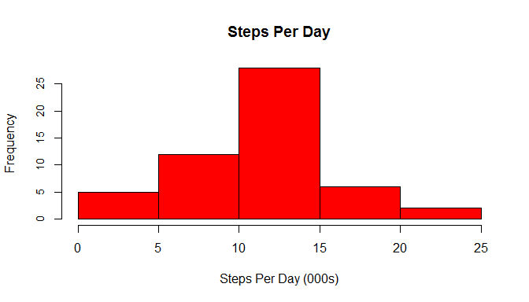

#READ THE DATA AND FORMAT DATES


The first step is to read in the data from the downloaded csv file.


```r
activity <- read.csv("./activity.csv")
```

Then we convert date from factor to string then to R date class.


```r
date_char <- as.character(activity$date)

activity$date_new <- as.Date(date_char, "%Y-%m-%d")
```


#AVERAGE TOTAL STEPS EACH DAY


First we will eliminate observations with NA.


```r
full <- complete.cases(activity)

activity_full <- activity[full,]
```

We can obtain the total steps per day using the plyr package.


```r
library(plyr)

total <- ddply(activity_full, .(date_new), summarize,
               total = sum(steps)
                )
```

We can produce a histogram of total steps using the base graphics.
Note that for ease of viewing, the x variable is in thousands.


```r
hist((total$total)/1000, 
     col = "red",
     yaxt = "n",
     main = "Steps Per Day",
     xlab = "Steps Per Day (000s)")

axis(side = 2, 
     cex.axis = .85) 
```

 

The mean and median total steps per day are easily obtained with the 
mean and median functions. The options changes the default for displaying
scientific notation.


```r
options(scipen = 1, digits = 2)

mean_spd <- mean(total$total)

med_spd <- median(total$total)
```

The mean total steps per day is 10766.19.  
The median total steps per day is 10765.


#AVERAGE DAILY ACTIVITY PATTERN


Using dataset without NA values, we get mean steps by interval with plyr package.


```r
int <- ddply(activity_full, .(interval), summarize,
               mean = mean(steps)
             )
```

We use base graphics to produce a line graph of average number of steps by 5 minute interval.


```r
with(int, plot(interval, mean,
               type = "l",
               main = "Average Steps by 5-Minute Interval",
               xlab = "Interval",
               ylab = "Average Steps"
               )
     )
```

 

We can obtain the 5-minute interval with maximum number of steps with which.max.


```r
max_int <- int$interval[which(int$mean == max(int$mean))]
```

The 5-minute interval with the maximum number of steps is 835.


#IMPUTING MISSING VALUES


The number of missing values is equal to the number of rows in the original dataset
minus the number of rows in the dataset with NAs removed.


```r
num_na <- nrow(activity) - sum(full)
```

The number of missing values is 2304.


We will replace missing values with the average steps for the associated 5-minute interval. 
First we create a function that will replace NA values with mean for x = dataframe$variable.
Then the ddply function from the plyr package calls replace_na to replace the NAs
with the mean number of steps for the observation's associated interval value.


```r
replace_na <- function(x) replace(x, is.na(x), mean(x, na.rm = TRUE))

activity_imp <- ddply(activity, ~ interval, transform, steps = replace_na(steps))
```

The next step is to reorder the imputed dataset by date and interval since the 
transform operation changes the order of the observations.  We can then 
use the plyr package to get the total number of steps per day.


```r
activity_imp <- arrange(activity_imp, date_new, interval)

total_imp <- ddply(activity_imp, .(date_new), summarize,
                   total = sum(steps)
                   )
```

The base graphics package produces a histogram of total steps with imputed data.
Again the values are plotted in thousands.


```r
hist((total_imp$total)/1000, 
     col = "red",
     yaxt = "n",
     main = "Steps Per Day with Imputed Data",
     xlab = "Steps Per Day (000s)")

axis(side = 2, 
     cex.axis = .85) 
```

 

The mean and median functions return their associated values for the imputed data.


```r
options(scipen = 1, digits = 2)

mean_spd_imp <- mean(total_imp$total, 2)

med_spd_imp <- median(total_imp$total, 2)
```

The mean total steps per day is 10766.19.  
The median total steps per day is 10766.19.


#DIFFERENCES IN ACTIVITY PATTERNS FOR WEEKDAYS AND WEEKENDS


First we create factor variable with levels "weekday" and "weekend."
The weekdays function is used to create a variable with the day of the week.
Then we reference this new variable to create the factor variable
using the mutate function from the dplyr package.


The next step is to get the average steps by 5-minute interval for weekday and weekend
with ddply from the plyr package.


```r
int_imp <- ddply(activity_imp, .(interval, day_type), summarize,
                 mean = mean(steps)
                 )
```

The lattice package produces a panel plot of steps taken averaged by weekday and weekend.


```r
library(lattice)

xyplot(mean ~ interval | day_type, data = int_imp, type = "l", layout = c(1, 2))
```

 
